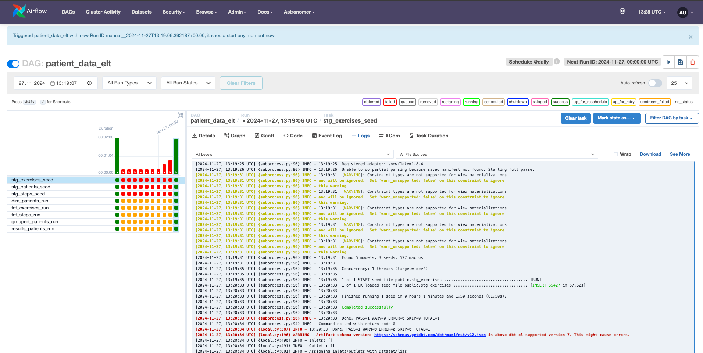

# Modus Operandi

The following document aims to gather all the steps I thought about during 
the development of the technical challenge.

# Landing the challenge

First, I read the challenge several times to make sure I understood the task. 
At first glance, it does not seem a very complex task, also the datasets are 
not very big so I suppose I will not have any issues processing the data.

The final output is based on the join of patients with steps and exercises 
accordingly and calculating the maximum sum of minutes (coming from steps and 
exercises) grouped by patient.

# Infrastructure discussion

Since I am familiar with Airflow and dbt (I did not use it in 2 years so let's
see what changed) and the challenge itself does not seem extremely 
complex, I would love to invest some time in creating a proper infrastructure:

 - Dockerized Airflow and dbt with connection to Snowflake

However, I have never deployed Airflow locally from scratch (everywhere I went,
it was already there) so I will leave deploying dbt in Airflow for the end.

I decided to use Snowflake as database based on:

- I did not use it before and I want to learn a new DB engine.
- It was listed in the nice-to-have list of the job offer.

Also, I would like to implement data QA tests (table constraints, business
criteria and schema checks), a CI/CD pipeline to automate python tests, add
renovate bot to the repository and documentation deployment to the git project, 
but we will see how it goes.

Not sure if I will create a dashboard for the results, but it would be nice as 
well. I have some ideas for other KPIs:

- Apart from `total_minutes`, we can show as well the minutes coming from 
steps and the ones coming from exercises, it could be a useful KPI to get more
insights about the rehabilitation.
- We can also split the maximum `total_minutes` per country and, as in the 
previous point, split it in exercises and steps.
- Steps and exercises submission_time(s) graphs (respectively) , it would be
great to know when (along the year) are usually the patients doing more steps
and exercises, maybe it has some effect on their rehabilitation time.

# Setting up Github

I am not sure if it is relevant but as I am using a laptop with an already
paired Gitlab account, I had to create another SSH key and assign this new SSH 
key to the Github account I am going to use for the challenge:

```shell
ssh-keygen -t ed25519 -C "my@mail.com"
ssh-add --apple-use-keychain ~/.ssh/my_id 
nano /Users/jonfernandez/.ssh/config
```

And here add:

```
  Host *
    UseKeychain yes
    AddKeysToAgent yes
    IdentityFile ~/.ssh/my_id
```
In Github SSH configuration section add the content of `cat ~/.ssh/my_id.pub`
as always. Finally, and I think this changed recently, I had to log in with
github-cli `gh auth login`.

# Setting up Snowflake

I am starting by setting up the Snowflake user for dbt as recommended in
[one of the Snowflake's quickstart guides.](https://quickstarts.snowflake.com/guide/data_engineering_with_apache_airflow/index.html#0)

```snowflake
USE ROLE SECURITYADMIN;

-- We create the role that DBT user will use: dbt_developer_role 
CREATE OR REPLACE ROLE dbt_developer_role COMMENT='DBT developer role';
GRANT ROLE dbt_developer_role TO ROLE SYSADMIN;

-- Create the DBT user
CREATE OR REPLACE USER dbt_user PASSWORD='dbt_password'
	DEFAULT_ROLE=dbt_developer_role
	DEFAULT_WAREHOUSE=dbt_warehouse
	COMMENT='DBT User';

GRANT ROLE dbt_developer_role TO USER dbt_user;

-- To grant privileges to the role we need to use a role with higher permissions 
USE ROLE ACCOUNTADMIN;

GRANT CREATE DATABASE ON ACCOUNT TO ROLE dbt_developer_role;

USE ROLE SYSADMIN;

-- Create Warehouse for DBT
CREATE OR REPLACE WAREHOUSE dbt_developer_warehouse
  WITH WAREHOUSE_SIZE = 'XSMALL'
  AUTO_SUSPEND = 120
  AUTO_RESUME = true
  INITIALLY_SUSPENDED = TRUE;

GRANT ALL ON WAREHOUSE dbt_developer_warehouse TO ROLE dbt_developer_role;
```

## Early data model approach

After that, we create the data model for our patients, exercises and steps.
The assumptions and standards I chose to follow:

- We prefer plural from singular table namings so as SQL code is more
intuitive: `SELECT * FROM patients;`
- We prefer explicit over implicit type definition (i.e. we use` NUMBER(38,0)`
instead of `INTEGER` so the amount of decimals is properly defined in the code
even though `NUMBER(38,0)` is the [standard in Snowflake for numeric data 
types](https://docs.snowflake.com/en/sql-reference/data-types-numeric#number))
- Same goes for string data types, we will be using `VARCHAR(16777216)` which
would be the same as using `VARCHAR` but we rather define the maximum length
of the field in our code.
- It would be great to align with the team in charge of building the source of
the data so as we can define properly the limits of the values in the columns 
and use it as a second type validation.
- In exercises and steps tables, `external_id` column names will be modified
to `patient_id`.
- For the timestamp columns, I used [TIMESTAMP_TZ](https://docs.snowflake.com/en/sql-reference/data-types-datetime#timestamp-ltz-timestamp-ntz-timestamp-tz) Snowflake type since,
in the data, it looks like the UTC offset is defined after the timestamp 
(i.e. `2024-04-11T14:25:23.708+0200`). However, we will need to take into 
account that _Attention_ section defined in the documentation when using this
field for creating KPIs, since the offset of some countries change during the 
year but not the value in the database. If possible I would ask the team in 
charge of creating the data source to send us the values of the TIMEZONE 
together with the timestamp (without the UTC offset in this case) so as we can 
calculate the UTC time in place when needed.
- In step tables, `submission_time` column name will be modified 
to `submitted_at`, like that all the columns with type `TIMESTAMP_TZ` will have
the same suffix and we will be able to identify the type of the column by its 
name.
- When trying to test how Snowflake is reading the timestamp values from the 
spreadsheet `SELECT '2023-04-19T19:03:58.0520200'::TIMESTAMP_TZ` I got
`Timestamp '2023-08-04T21:26:24.871+0200' is not recognized` so I tried:

```snowflake
ALTER SESSION SET TIMESTAMP_TZ_OUTPUT_FORMAT = 'YYYY-MM-DDTHH24:MI:SS.FF3TZHTZM';
```

It looks like it can read it know, we will take care of this when importing the
data to Snowflake. 

The table creation script I used for the staging tables is the following:
```snowflake
CREATE OR REPLACE DATABASE caspar_health;
USE ROLE dbt_developer_role;

CREATE TABLE stg_patients (
    row_id  NUMBER(38, 0),
    patient_id NUMBER(38, 0),
    first_name VARCHAR(16777216),
    last_name VARCHAR(16777216),
    country VARCHAR(16777216)
);
CREATE TABLE stg_exercises (
    id NUMBER(38, 0),
    external_id NUMBER(38, 0),
    minutes NUMBER(38, 0),
    completed_at VARCHAR(16777216),
    updated_at VARCHAR(16777216)
);
CREATE TABLE stg_steps (
    id NUMBER(38, 0),
    external_id NUMBER(38, 0),
    steps NUMBER(38, 0),
    submission_time VARCHAR(16777216),
    updated_at VARCHAR(16777216)
);

ALTER SESSION SET TIMESTAMP_TZ_OUTPUT_FORMAT = 'YYYY-MM-DDTHH24:MI:SS.FF3TZHTZM';
```

# Setting up DBT

## Setting up the Python environment
I am going to be using [uv](https://github.com/astral-sh/uv) as a python 
package manager to start with the dbt dependencies. It is being a while since 
I wanted to try uv out, is supposed to be very fast.

```
brew install uv
uv init caspar_health_technical_challenge
uv add dbt-core
uv add dbt-snowflake
```

*_Yes, it was fast indeed._

I am not using `dbt-cloud` since looks expensive for what it offers and it is 
not really complicated to set up and deploy `dbt-core` but maybe I regret it. 
I run `dbt init` to create the dbt project. Then, `dbt deps` to install the 
dependencies (`dbt-labs/dbt_utils`). The dbt profile would look as follows:

```shell
caspar_health_technical_challenge:
  outputs:
    dev:
      account: RG94457.EU-CENTRAL-1
      database: CASPAR_HEALTH
      password: dbt_password
      role: dbt_developer_role
      schema: rehabilitation_data
      threads: 1
      type: snowflake
      user: dbt_user
      warehouse: dbt_developer_warehouse
  target: dev
```

It took me some time to figure the Snowflake connection parameters out to 
create the dbt profile, more specifically;

- **account**: I had to run a query on Snowflake to get it.
```Snowflake
SELECT CONCAT_WS('.', CURRENT_ACCOUNT(), REPLACE(REGEXP_REPLACE(CURRENT_REGION(), '^[^_]+_',''), '_', '-')); -- e.g.: `YY00042.EU-CENTRAL-1`
```
- **password and user**: I did not know if it was the Snowflake account or the 
database specific account.

I added a `generate_schema_name` and `set_query_tag` macros as recommended 
in the [Snowflake quickstart guide]([documentation](https://quickstarts.snowflake.com/guide/data_engineering_with_apache_airflow/index.html#0)) I am following.

## Loading raw data

After setting up dbt, I decided to try to import the raw data into Snowflake.
I added the CSV files into the `seeds` folder and tried to run `dbt seed`
but I got the following error:

```shell
Runtime Error
  Database error while listing schemas in database "CASPAR_HEALTH"
  Database Error
    002043 (02000): SQL compilation error:
    Object does not exist, or operation cannot be performed.
```

And since I could not see the query, I went to the logs, and apparently I was 
trying to run `show objects in CASPAR_HEALTH.rehabilitation_data limit 10000`
but, of course, `rehabilitation_data` schema does not exist, it should 
be `public` instead. For some reason, I thought that DBT was creating a 
new schema when adding data from seeds.

I took the decision of adding the `stg` suffix to the tables names containing 
raw data as specified in dbt documentation. I learned that, [according to this 
post,](https://www.y42.com/learn/dbt/dbt-seed#overview-of-dbt-seeds)
apparently `dbt seeds` is not the greatest option to bulk raw data into 
Snowflake and, honestly, I would rather define a dbt model with
[COPY INTO table](https://docs.snowflake.com/en/user-guide/data-load-s3-copy) clause, but I do not have any personal cloud storage 
account so I am going with dbt seeds for this very specific challenge.

The data bulk worked with no issue for `steps` and `exercices`, however, for 
`patients`, I had to use `--full-refresh` option (only for the very first time 
we bulk the data) since the 1st column name is empty. Due to that, the 1st 
column name for this table will have `A` as a column name instead of `row_id` 
as planned. We could have avoided this by loading the data directly from a 
cloud storage and just not selecting that column. I am not planning on using
the column anyway in further tables, so it should not be an issue.

## Dimensions and facts

Once our raw data has been loaded, is time to discuss which 
transformations we will be doing to our data.

For this specific case and with no further knowledge about future 
requirements, I would go with a simple dimensions and facts data model design
where Patients will be the main dimension and Steps and Exercises the 
facts that do not make sense without our dimension. The data model design 
has not a big impact in this specific case apart from helping understand our 
data and defining the primary keys (`id` in `patients`) and foreign keys 
(`patient_id` in `steps` and `exercises`). 

This tables will be kept in `transform` schema (as defined in the
[Snowflake guide we are following](https://quickstarts.snowflake.com/guide/data_engineering_with_apache_airflow/index.html#0)) since they are part of the base layer of our model, and 
they all should have a `seed` or raw data as source. In this state
we will be taking care of the transformations mentioned in section
[Early data model approach](#early-data-model-approach) and automatic dbt 
data QA tests defined on the table constraints such as:

    - primary keys (unique, not null)
    - foreign keys (referenced to the origin)
    - type validation

I added `not null` constraint to almost every field in the data model because 
the data shows that it is possible, however, it would be great to confirm 
and truly redefine which columns expect `null` values and which do not.

Since we do not have any constraint in one model that applies to multiple 
columns, we will be only defining `column-level` constraints and not 
`model-level` constraints. Also, we are going to use one file per model to 
define the schema instead of defining all the schemas in the same file so 
the code structure scales up in a clean and organized way.

## Analysis tables

Finally, we are building two analysis tables and we will be using `analysis`
schema for that.

First, we will join patients data with steps and exercises data so as we can
group it and sum it. We will also be creating the KPI `total_minutes`, a sum of
the minutes coming from steps and exercises, so as we can get the maximum 
value(s) in the last results table. And last but not list, we will create a 
column with a `RANK()` window function ordered by `total_minutes` descendant, 
which will return the same value in case the maximum value is repeated for 
different patients.

Second, we will obtain our aimed KPI filtering the rank field we created in the 
previous table with `1`. 

```snowflake
SELECT *
FROM caspar_health.analysis.results_patients;
```


|patient_id:int | first_name:str | last_name:str | country:str | total_minutes:number(38,3) |
|---------------|----------------|---------------|---------------|----------------------------|
|356134|Austin|Ellis|Germany| 54954235.000               |

*_`total_minutes` column is decimal type (and it was proposed to be `int` 
 type) since one of the columns involved in the KPI had 3 decimals as well._

I would love to create more KPIs as defined in [Infrastructure discussion](#infrastructure-discussion) 
section, but I am going to focus on deploying dbt in Airflow, adding 
python pytest tests, sqlfluff, ruff and proper documentation first.

# Setting up Airflow

Following the [Snowflake guide](https://quickstarts.snowflake.com/guide/data_engineering_with_apache_airflow/index.html#5)
we might need to get rid of uv for setting up python requirements and go with
plain pip requirement management. We will now prepare the repository for 
encapsulating our model creation with dbt inside an airflow repository 
ready to be deployed.

We can create a dockerized airflow repository by creating a new folder and 
running `astro dev init` (from [astro](https://www.astronomer.io/docs/astro/)), after that I will just add all my dbt packages
inside `dags/dbt/caspar_health_dbt_cosmos` folder.

## Setting up the DAG

The `patient_data_elt` DAG is only composed by:
1. Dbt profile definition: Which basically, thanks to a very cool [cosmos](https://github.com/astronomer/astronomer-cosmos)
library, reads all the credentials from the predefined Airflow connections in 
`airflow_settings.yaml`. Given the use case, I am not going to spend more time 
trying to hide the secrets since in a real-life scenario I would just use 
[Airflow AWS Secrets Manager Backend](https://airflow.apache.org/docs/apache-airflow-providers-amazon/stable/secrets-backends/aws-secrets-manager.html)
for getting the credentials of the connections.
2. Dbt DAG: We create tasks that run every existing model in
DBT, even the seeds creating a `DbtDag` module.



## Astro and cosmos
I did not use `astro` and `cosmos` until today and is crazy how easy they make:

- **Astro**: It deploys the webserver, the scheduler and the trigger 
(I guess this is the Celery queue). I just did not need to think about it, 
which is nice for this use case. However, I can imagine that those layers of 
abstraction that adds on top of Airflow might be a bit cumbersome when we want
to adjust Airflow to some specific needs. Also, it took me quite some time to
discover how to deploy the connections defined on `airflow_settings.yaml`: 
```
astro dev object import
astro dev restart
``` 

- **Cosmos**: I really do not have any complains about it for now but again, it 
could be not the best option if we want to really get the most out of dbt.

# Setting up tests (TNDD)

Well, I would have loved to apply TDD during the implementation of the solution, 
however, I got excited by the use of uv at the beginning and I forgot about it.
That is why I suggesto calling the development followed in this technical 
challenge TNDD as in Test Non Driven Development.

I did not add any python tests myself since I did not see the case for it, 
maybe it would have been great to:

- Test somehow the connection with Snowflake (with a given dbt profile)
- Test the output of the dbt models somehow.

What I did add is `sqlfluff` and `ruff`, which are very nice SQL and python 
linters that help so much following predefined code standards.

```shell
╰─>$ make fix-format
All checks passed!
==== finding fixable violations ====
  [5 templating/parsing errors found]                                                                                                                                                            
==== no fixable linting violations found ====                                                                                                                                                    
All Finished 📜 🎉!
  [10 unfixable linting violations found]
make: *** [fix-format] Error 1
```

## Makefile

In case the `astro` wrapper was not enough, I built a small Makefile, so it is
easier for the person reading this to deploy and run commands. Moreover, I just
like Makefiles, they are cool. 


